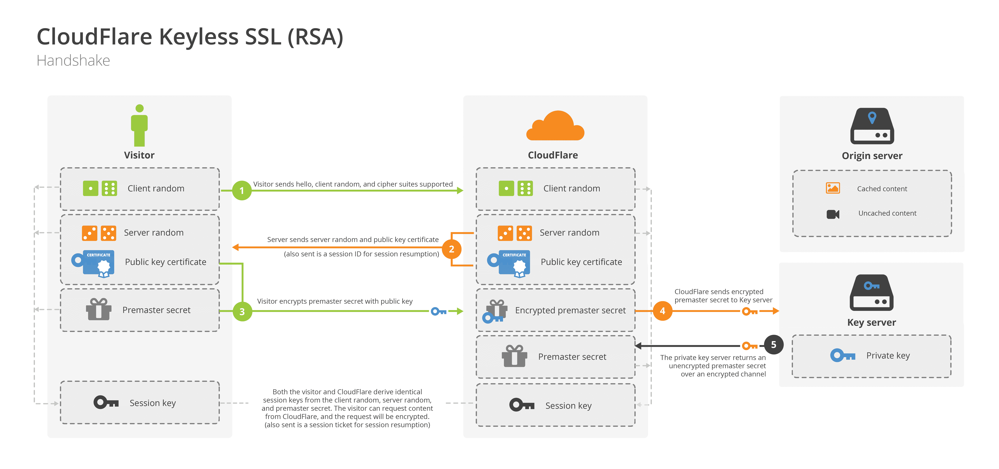
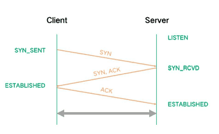
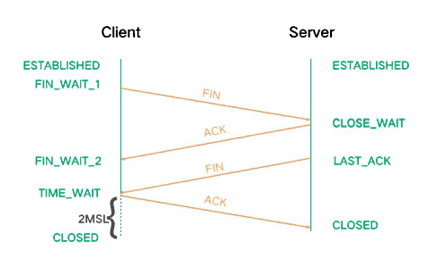

### 计算机网络

首先梳理一下经典的OSI七层网络模型及TCP/IP四层网络模型，七层模型过于复杂，在实践过程中精简成了四层模型。本文主要介绍模型对应的HTTP/S、TCP/UDP/IP协议

| OSI 七层模型          | TCP/IP 四层模型 | 对应网络协议                             |
| ----------------- | :---------- | ---------------------------------- |
| 应用层（Application）  | 应用层         | HTTP、FTP、SMTP、NFS                  |
| 表示层（Presentation） |             | Telnet、Rlogin、SNMP、Gopher          |
| 会话层（Session）      |             | SMTP、DNS                           |
| 传输层（Transport）    | 传输层         | TCP、UDP                            |
| 网络层（Network）      | 网络层         | IP、ICMP、ARP、RARP、AKP、UUCP          |
| 数据链路层（Data Link）  | 数据链路层       | FDDI、Ethernet、Arpanet、PDN、SLIP、PPP |
| 物理层（Physical）     |             | IEEE 802.1A、IEEE 802.2到IEEE 802.11 |

#### HTTP

> HTTP（HyperText Transfer Protocol，超文本传输协议）是互联网上应用最广泛的一种应用协议，是现代Web的基础

##### HTTP 0.9

* 请求是一个ASCII字符串，只有一行，以回车符结尾
* 响应是一个ASCII字符流
* 每次请求后连接就会关闭

##### HTTP 1.0

相比HTTP 0.9功能大幅增强

* 增加了状态码和header
* 响应体不局限于超文本，支持HTML文件、纯文本文件、图片等其他内容类型
* 多字符集支持
* 缓存支持，使用`Pragma`和`Expires`来作为缓存判断的标准
* 默认请求后连接关闭，可通过设置请求头`Connection: keep-alive`来实现连接复用

##### HTTP 1.1

在HTTP 1.0基础上，HTTP 1.1做了大量改进，比较熟知的有

* 改进的更好的缓存机制。支持`Cache-Control/E-tag/If-None-Match/If-Mofified-Since/Last-Modified`等更多可供选择的缓存头来控制缓存策略

* 字节服务以支持基于范围的资源请求。引入`range`头，支持请求部分资源

* Host头处理，在HTTP1.0中认为每台服务器都绑定一个唯一的IP地址，因此，请求消息中的URL并没有传递主机名（hostname）。但随着虚拟主机技术的发展，在一台物理服务器上可以存在多个虚拟主机（Multi-homed Web Servers），并且它们共享一个IP地址。HTTP1.1的请求消息和响应消息都应支持Host头域，且请求消息中如果没有Host头域会报告一个错误（400Bad Request）

* 持久化连接以支持连接复用。默认启用`Connection: keep-alive`

* 分块传输编码以支持流式响应

  > 通常，HTTP应答消息中发送的数据是整个发送的，Content-Length消息头字段表示数据的长度。数据的长度很重要，因为客户端需要知道哪里是应答消息的结束，以及后续应答消息的开始。然而，使用分块传输编码，数据分解成一系列数据块，并以一个或多个块发送，这样服务器可以发送数据而不需要预先知道发送内容的总大小

* 请求管道以支持并行请求处理。持久连接解决了连接复用问题，但还是存在着一个问题：在一个 TCP 连接中，同一时间只能够发送一个请求，并且需要等响应完成才能够发送第二个请求。因此 HTTP/1.1 制订了 Pipeline，通过这个管道，浏览器的多个请求可以同时发到服务器，但是服务器的响应只能够一个接着一个的返回。事实上，由于HTTP 1.x不支持多路复用，HTTP管道存在很多问题：

  > 如果对客户端和服务器有完全控制的权限，管道仍然是一个很好的优化手段，比如苹果iTunes。
  >
  > 使用HTTPS，可避免那些不支持管道的中间代理的干扰

  * 一个慢响应就会阻塞所有后续请求
  * 并行处理请求时，服务器必须缓冲管道中的响应，从而占用服务器资源，如果有个响应非常大，则很容易形成服务器的受攻击面
  * 响应失败可能终止TCP连接，从而强迫客户端重新发送对所有后续资源的请求，导致重复处理
  * 由于可能存在中间代理，因此检测管道兼容性，确保可靠性很重要
  * 如果中间代理不支持管道，那它可能会中断连接，也有可能会把所有请求串联起来

##### HTTP 2.0

HTTP 2.0致力于突破上一代标准众所周知的性能限制，是对1.x标准的扩展，而非替代。主要变化有

* 二进制分帧层。基于此，实现多路复用，即每个来源一个连接

  * 帧是最小的通信单位，所有通信在一个TCP连接上完成

  * 共享的8字节帧首部：包括16位长度、8位帧类型、8位标志、1位保留字段始终置为0、31位流标识符唯一标识HTTP 2.0的流

    HTTP 2.0规定了如下帧类型

    * DATA：用于传输HTTP消息体

    * HEADERS：用于传输关于流的额外的首部字段

    * PRIORITY：用于指定或重新指定引用资源的优先级

    * RST_STREAM：用于通知流的非正常终止

    * SETTINGS：用于通知两端通信方式的配置数据

    * PUSH_PROMISE：用于发出创建和服务器引用资源的要约

    * PING：用于计算往返时间，执行“活性”检查

    * GOAWAY：同于通知对端停止在当前连接中创建流

      > 服务器可以利用 GOAWAY 类型的帧告诉客户端要处理的最后一个流的ID，从而消除一些请求竞争，而且浏览器也可以据此智能地重试或取消“悬着的”请求。这也是保证复用连接安全的一个重要和必要的功能

    * WINDOW_UPDATE：用于针对个别流或个别连接实现流量控制

    * CONTINUATION：用于继续一系列首部块片段

  * 16位的长度表明理论上一帧最大可携带64kb的帧净荷，为了减少队头阻塞，HTTP 2.0标准要求DATA帧不能超过$2^{14} - 1$（16383）字节

* 请求优先级

  每个流可以带有一个31比特的优先值，0表示优先级最高

* 首部压缩

  > 压缩算法包括zlib压缩算法和下面要介绍的索引表压缩算法。由于zlib压缩算法存在安全漏洞而被撤销

  * HTTP 2.0在客户端和服务器端使用“首部表”来跟踪和存储之前发送的键值对，对于相同的数据，不在通过每次请求和响应发送

    > 服务器需要存储每个连接的首部表，会增加内存开销

  * 首部表在HTTP 2.0的连接存续期间内始终存在，有客户端和服务器共同渐进地更新

  * 每个新的首部键值对要么被追加到当前表的末尾，要么替换表之前的值

* 服务器推送

* 流量控制

> HTTP 2.0虽然取得了巨大的改进，但仍是基于TCP协议，TCP的缺点它都有
>
> 1. 虽然消除了HTTP队首阻塞现象，但TCP层次上仍然存在队首阻塞
> 2. 如果TCP窗口缩放被禁用，那带宽延迟积效应可能会限制连接的吞吐量
> 3. 丢包时，TCP拥塞窗口会缩小

##### HTTP 3.0 （QUIC）

* 实现了类似TCP的流量控制、传输可靠性的功能
* 集成了TLS（Transport Layer Security 传输层安全性协议）加密功能
* 实现了HTTP/2.0中多路复用。不同点是QUIC实现了在同一物理连接上可以有多个独立的逻辑数据流，实现了数据流的单独传输，解决了TCP中队头阻塞问题
* 实现了快速握手功能。QUIC是基于UDP的，所以QUIC可以实现使用0-RTT或1-RTT来建立连接
* 存在的挑战：
  * 服务器与浏览器端都没有对HTTP/3.0提供较完整的支持
  * 部署HTTP/3.0也存在非常大的问题，因为系统对UDP优化还不是很好
  * 中间设备僵硬问题，这些设备对UDP的优化程度远低于TCP

#### HTTPS

> * HTTPS运行在安全套接字协议(Secure Sockets Layer，SSL )或传输层安全协议（Transport Layer Security，TLS）之上，所有在TCP中传输的内容都需要经过加密
> * 连接方式不同，HTTP的端口是80，HTTPS的端口是443.
> * HTTPS可以有效防止运营商劫持。

建立HTTPS连接需要经过TLS 4次握手

先上图（图片摘自[CloudFlare](https://blog.cloudflare.com/announcing-keyless-ssl-all-the-benefits-of-cloudflare-without-having-to-turn-over-your-private-ssl-keys/)）

> 上图中是CloudFlare的使用RSA加密的握手过程，这里假设加解密是在服务器本地完成的，即没有Key server

下面详细说明四次握手的步骤：

* 第一次

  客户端向服务端发送Client Hello消息，消息以明文形式传输，里面包括客户端支持的协议版本、加密套件、压缩算法、随机数R1、扩展字段等。加密套件包括认证算法（Au）、密钥交换算法（KeyExchange）、对称加密算法（Enc）和信息摘要算法

* 第二次

  1. 服务端发送Server Hello消息进行响应，以明文传输。消息包括确认使用的协议版本、服务端生成的随机数R2、确认使用的加密套件和压缩方法
  2. 发送完Server Hello消息后，服务端马上将自己的Certificate（公钥证书）发送给客户端
  3. *Server Key Exchange并非必需选项，只有在选用了DH算法的情况下，服务器需要将DH参数发送给客户端，若选择了RSA算法则不需要发送Server Key Exchange*
  4. *Certificate Request也并非必须选项，在对于安全性要求较高的场景中，服务器可要对客户端的身份进行认证，因此发起了对客户端公钥证书的请求，一般情况下浏览器都会内置一对独一无二的公私钥*
  5. 由于第二次握手中包含一些可选选项，因此需要服务器发送一个Server Hello Done的消息，用来通知客户端Server Hello过程结束

* 第三次

  > 在客户端收到Server Hello Done之后并没有马上进行第三次握手，而是先对服务器传来的证书进行验证，一般会验证证书是否在有效期内，随后根据CRL或者OCSP查询证书是否有效，最后根据证书链从根CA开始验证直到网站证书，以确保证书的真实性。在这个过程中若出现了验证不通过的结果，则抛出相应的错误；若验证通过，就再生成一个随机数Pre-master，并用服务器公钥进行加密，生成PreMaster Key

  1. Client Key Exchange就是客户端将PreMaster Key发送给服务器，服务器则会用自己的私钥解密得出Pre-master。到这里客户端和服务器都拥有了三个随机数R1、R2和Pre-master，两边再用相同的算法和这三个随机数生成一个密钥，用于握手结束后传输数据的对称加密
  2. Change Cipher Spec是客户端向服务器通知，后面发送的消息都会使用协商出来的密钥进行加密
  3. Encrypted Handshake Message是客户端向服务发送握手数据加密信息，该信息是客户端将前面的握手消息利用协商好的摘要算法生成摘要，再用协商好的密钥对摘要进行加密而的出来的，最后将加密信息发送给服务器，这是客户端发出的第一条加密信息。而服务器也会用协商好的密钥进行解密，若能成功解密则说明协商出来的密钥是一致的
  4. *Certificate是在第二次握手的第4步有进行的情况下，即服务器有向客户端请求证书的情况才会有的，这一步是客户端向服务器发送客户端的证书，而服务器收到证书后也会对证书进行相同的验证*

* 第四次

  1. Change Cipher Spec是服务器向客户端通知，后面发送的消息都会使用协商出来的密钥进行加密
  2. Encrypted Handshake Message与第三次握手类似，是服务器发给客户端的用来确定协商的密钥是一致的，也是一条Server Finish消息

#### TCP

TCP是传输层协议，负责在不可靠的传输信道上提供可靠的抽象层，向应用层隐藏了大多数网络通信的复杂细节，比如丢包重发、按序发送、拥塞控制及预防、数据完整等。

所有TCP连接开始都要经过三次握手

> 1. 三次握手是为了解决“网络中存在延迟的重复分组”的问题，建立**稳定的双向**连接
> 2. 建连时，可能发生`SYN`洪水攻击。即Client端建立连接后，不回复`ACK`，导致Server端大量链接处于`SYN_RCVD`状态，进而影响其他正常请求的建连。可设置 `tcp_synack_retries=0`加快半连接的回收速度，或者调大`tcp_max_syn_backlog`来应对少量的SYN洪水攻击

断开需要四次挥手

> 1. TCP是全双工的通信机制，每个方向必须单独进行关闭，所以需要四次挥手关闭连接
> 2. 为什么等待时间是2MSL？
>    * 客户端发送的ACK segment存活期1MSL，服务端重发FIN segment存活期1MSL，加一起2MSL。2MSL是一个临界值，利用尽量大的等待时间来确保TCP连接断开的可靠性

##### TCP的优化机制

> 流量控制和慢启动都属于拥塞控制

* **流量控制** 是一种预防发送端过多向接收端发送数据的机制
* **慢启动**
* **拥塞预防**

##### TCP的缺点

* **队首阻塞** 

#### UDP

#### IP

参考资料：Web性能权威指南