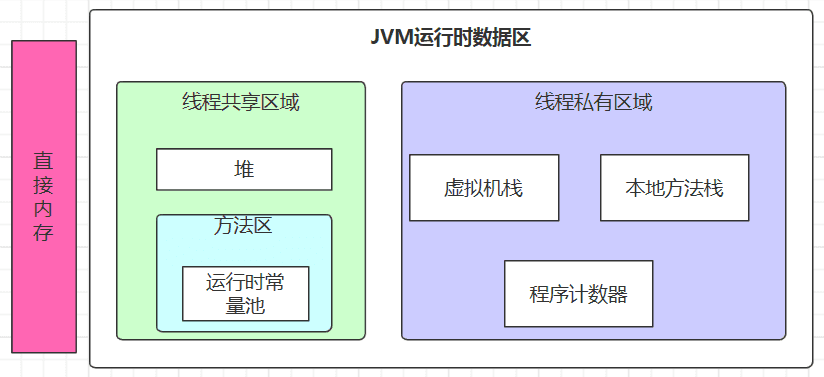
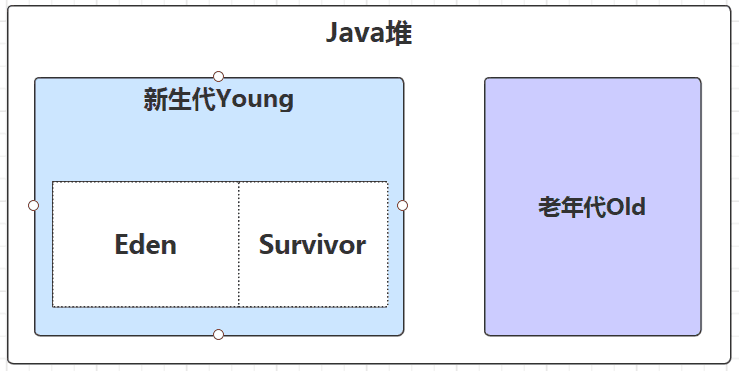
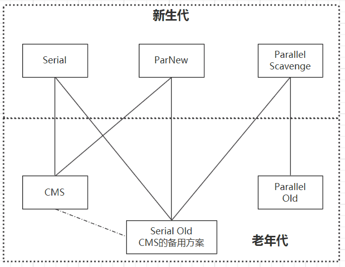
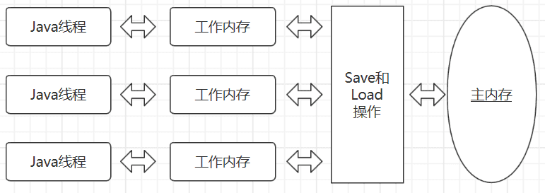

## JAVA简记

### 一、基础

#### 1. 数据类型

1. 基本数据类型
   - 数值型
     - 整数类型 byte/short/int/long
     - 浮点类型 float/double
   - 字符型 char
   - 布尔型 boolean
2. 引用数据类型
   - 类 class
   - 接口 interface
   - 数组

#### 2. String、StringBuilder、StringBuffer的区别

* String：字符串常量，不可修改，不可继承
* StringBuilder：不可继承，非线程安全，*toString*方法不会对结果进行缓存
* StringBuffer：不可继承，线程安全，*toString*方法会对结果进行缓存


#### 3. 序列化

* 实现方式：Serializable， Externalizable（可自定义序列化字段）
* 不序列化：transient关键字修饰

* **serialVersionUID的作用** 其目的是序列化对象版本控制，有关各版本反序列化时是否兼容

* XML、JSON、Hession、Protobuf


### 二、锁

#### 1. 乐观锁/悲观锁

##### 1.1 乐观锁

总是认为不存在并发问题，每次去取数据的时候，总认为不会有其他线程对数据进行修改，因此不会上锁。但是在更新时会判断其他线程在这之前有没有对数据进行修改，一般会使用“数据版本机制”或“CAS操作”来实现。

* 数据版本机制

  1. 版本号

     在数据表里加一个版本号version字段，当数据被修改时，version值加1。如

     ```sql
     update table set xxx=#{xxx}, version=version+1 where id=#{id} and version=#{version};
     ```

  2. 时间戳


* CAS操作

  当多个线程同时更新一个变量时，只有一个线程能更新成功，失败的线程不会被挂起，会被告知竞争失败，可再次尝试。CAS操作中包含三个操作数——需要读写的内存位置(V)、进行比较的预期原值(A)和拟写入的新值(B)。如果内存位置V的值与预期原值A相匹配，那么处理器会自动将该位置值更新为新值B，否则处理器不做任何操作。

  > 用版本号可解决CAS的ABA问题

##### 1.2 悲观锁

* 在对任意记录进行修改前，先尝试为该记录加上排他锁（exclusive locking）

* 如果加锁失败，说明该记录正在被修改，那么当前查询可能要等待或者抛出异常

* 如果成功加锁，那么就可以对记录做修改，事务完成后就会解锁了

* 期间如果有其他对该记录做修改或加排他锁的操作，都会等待我们解锁或直接抛出异常

#### 2. 独享锁/共享锁

* 独享锁 同时只能被一个线程持有
* 共享锁 同时可被多个线程持有

#### 3. 互斥锁/读写锁

* 上面讲的独享锁/共享锁就是一种广义的说法，互斥锁/读写锁就是具体的实现
* 互斥锁在Java中的具体实现就是ReentrantLock
* 读写锁在Java中的具体实现就是ReadWriteLock

#### 4. 可重入锁

* 又名递归锁，是指在同一个线程在外层方法获取锁的时候，在进入内层方法会自动获取锁。说的有点抽象，下面会有一个代码的示例

  ```java
  synchronized void methodA() throws Exception {
      Thread.sleep(1000);
      methodB();
  }
  synchronized void methodB() throws Exception {
      Thread.sleep(1000);
  }
  ```

* ReentrantLock、synchronized都是可重入锁，可避免死锁

#### 5. 公平锁/非公平锁

* 公平锁是指多个线程按照申请锁的顺序来获取锁

* 非公平锁是指多个线程获取锁的顺序并不是按照申请锁的顺序，有可能后申请的线程比先申请的线程优先获取锁。有可能会造成优先级反转或者饥饿现象

#### 6. 分段锁

* 是一种锁的设计，并不是具体的一种锁
* Java8的ConcurrentHashMap放弃了分段锁

#### 7. 偏向锁/轻量级锁/重量级锁

* 是指synchronized锁的三种状态，在Java 5通过引入锁升级的机制来实现高效Synchronized。这三种锁的状态是通过对象监视器在对象头中的字段来表明的
* 偏向锁是指一段同步代码一直被一个线程所访问，那么该线程会自动获取锁，降低获取锁的代价
* 轻量级锁是指当锁是偏向锁的时候，被另一个线程所访问，偏向锁就会升级为轻量级锁，其他线程会通过自旋的形式尝试获取锁，不会阻塞，提高性能
* 重量级锁是指当锁为轻量级锁的时候，另一个线程虽然是自旋，但自旋不会一直持续下去，当自旋一定次数的时候，还没有获取到锁，就会进入阻塞，该锁膨胀为重量级锁。重量级锁会让他申请的线程进入阻塞，性能降低

#### 8. 自旋锁

* 在Java中，自旋锁是指尝试获取锁的线程不会立即阻塞，而是采用循环的方式去尝试获取锁，这样的好处是减少线程上下文切换的消耗，缺点是循环会消耗CPU

#### 9. 锁优化

* 自旋锁与自适应锁
* 锁消除 如StringBuffer.append()
* 锁粗化
* 轻量级锁、偏向锁

#### 10. Other

1. synchronized和lock的区别
   * synchronized是关键字，Java内置；lock是一个Java类
   * synchronized无法判断是否获取锁；lock可以
   * synchronized锁会自动释放；lock需要在finally中手动释放
   * synchronized 线程1阻塞，则线程2永久等待下去；lock可以通过tryLock方法尝试获取锁，如果获取不到锁，可以结束等待
   * synchronized 可重入，不可中断，非公平；lock锁，可重入、可判断、可公平


### 三、JVM

#### 1. Java运行时数据区

运行时数据区划分如下图



* 程序计数器 线程私有，记录运行的虚拟机字节码指令地址（如果是native方法，则为空）。唯一一个没有规定任何OutOfMemoryError情况的区域

* 虚拟机栈 每个方法在执行的同时都会创建一个栈帧，用于操作局部变量表、操作数栈、动态链接、方法出口等信息。

* 本地方法栈

* 堆 

  

  * 大小可扩展，也可固定（通过-Xmx和Xms控制）


  * 所有对象实例及数组都要在堆上分配（逃逸分析，栈上分配、标量替换？）

* 方法区 用于存储已被虚拟机加载的类信息、常量、静态变量、即时编译器编译后的代码等数据。

  * 运行时常量池 运行期间可将新的常量放入池中，如String.intern()方法

* > 直接内存：不属于运行时数据区，也不是虚拟机规范中定义的内存区域。
  >
  > NIO使用native函数库直接分配堆外内存，不受Java堆大小的限制

#### 2. 垃圾收集器与内存分配策略

##### 2.1 判断垃圾是否存活的算法

* 引用计数法 简单、高效，但无法解决对象间互相引用的问题
* 可达性分析算法 通过一组GC Root，判断对象是否可通过任一GC Root找到。可作为GC Root的对象包括：
  * 虚拟机栈（局部变量表）中引用的对象
  * 方法区中静态引用指向的对象
  * 方法区中常量引用的对象
  * 本地方法栈中JNI引用的对象

##### 2.2 垃圾回收算法

* 标记-清除算法 Mark-Sweep

  * 效率问题 标记和清除的效率不高
  * 空间问题 标记清除后产生大量不连续的内存空间

* 复制算法 将可用内存按容量划分为大小相等的两块，每次只使用其中的一块

  * 实现简单，运行高效

  * 空间利用率太低

    > 现在很多商业虚拟机采用这种算法来回收新生代，只不过不是按照1:1来划分，而是8（Eden）:1（Survivor）:1，具体比例可调整。适用于对象存活率低的情况

* 标记-整理算法 Mark-Compact一般用于收集老年代

* 分代收集算法 复制算法（新生代）+ 标记-整理算法（老年代）

##### 2.3  垃圾收集器

垃圾判断需要枚举GC Root，这个过程需要停止其他所有线程（Stop the World），从而衍生出不同的垃圾收集器



* 新生代收集器

  * Serial收集器 单线程收集器，Stop the World。适用于Client模式下（如桌面应用）
  * ParNew收集器 Serial收集器的多线程版本。Server模式下首选，能与CMS收集器配合使用
  * Parallel Scavenge收集器 吞吐量优先，以降低垃圾收集所占时间比例为目的。

* 老年代收集器

  * Serial Old

  * Parallel Old JDK1.6开始提供

  * CMS Concurrent Mark Sweep获取最短回收停顿为目标。

    * 初始标记 Stop the World
    * 并发标记
    * 重新标记 Stop the World
    * 并发清除 -XX:CMSFullGCCsBeforeCompaction参数用于设置多少次不压缩的Full GC后，跟着来一次压缩的（默认每次Full GC都进行碎片整理）

    > 对CPU资源非常敏感；无法处理浮动垃圾；大量空间碎片（Mark-Sweep）

  * G1（Grabage First）

    * 初始标记
    * 并发标记
    * 最终标记
    * 筛选回收

  * ### ZGC：可伸缩低延迟垃圾收集器

##### 2.4 类初始化顺序

* 加载
* 连接
  * 验证 确保被加载的类的准确性
  * 准备 为类的静态变量分配内存，并将其初始化为默认值
  * 解析 把类中的符号引用转换为直接引用（指针）
* 初始化
  * 初始化一个类或者接口时，并不会先初始化它的父接口
  * 初始化顺序
  * * 父类静态变量
    * 父类静态代码块
    * 子类静态变量
    * 子类静态代码块
    * 父类成员变量
    * 父类构造函数
    * 子类成员变量
    * 子类构造函数

#### 4. JMM

Java Memory Model，屏蔽各种硬件和操作系统的内存访问差异，以实现让Java程序在各种平台下都能达到一致的内存访问效果。

#### 1、主内存与工作内存

* 线程间变量值的传递需要通过主内存来完成

* 线程工作内存中保存了被该线程用到的变量的主内存的副本拷贝，线程对变量的所有操作都必须在工作内存中进行

* 线程、主内存(RAM)、工作内存(寄存器/高速缓存)三者关系如下图

    

#### 2、内存间交互操作

* lock 锁定

* unlock 解锁

* read 从主内存中读取

* load 作用于***工作内存变量***，它把read操作得到的变量值放入工作内存的变量副本中

* use 作用于工作内存变量

* assign(赋值) 作用于工作内存变量

* store 作用于工作内存变量

* write 作用于***主内存变量***

  > read和load，store和write必须成对出现
  >
  > **对一个变量执行unlock之前，必须先把此变量同步回主内存中（执行store、write操作）**

#### 3、volatile变量的特殊规则

* volatile修饰的变量具有2种特性

  * 此变量对所有线程立即可见性（每次使用从主内存读取刷新，每次改变写入主内存）

    > 附加规则：load和use，assign和store必须成对出现
    >
    > 除了volatile关键字之外，还有2个关键字能实现可见性，synchronized和final（为什么？）
    >
    > > synchronized基于锁，final基于不可变

  * 禁止指令重排序，非线程安全，适用场景满足以下2个规则

    * 运算结果并不依赖变量的当前值，或者只有单一的线程修改变量的值

    * 变量不需要与其它的变量共同参与不变约束

      > 如多个线程使用同一标志判断任务是否需要结束

#### 4、先行发生原则

* 时间先后顺序与先行发生原则没有必然联系，并发一切以先行发生原则为准

### 四、JUC

> `JUC`: java.util.concurrent

#### 1. 进程和线程

* 进程 系统资源（CPU、内存等）分配的基本单位，是一个程序，可能有多个线程。进程间相互独立

* 线程 CPU调度的基本单位，Java程序至少包含2个线程（Main、GC）。线程有6中状态

  ```java
  public enum State {
    NEW,//创建后尚未启动
    RUNNABLE,//包括操作系统线程状态中的Running和Ready
    BLOCKED,//阻塞
    WAITING, //无期限等待
    TIMED_WAITING, //期限等待
    TERMINATED;//终止
  }
  ```

* 并发 多线程、快速交替

* 并行 多核多CPU

* wait和sleep的区别

  * 所属类不同，wait-Object，sleep-Thread
  * 是否释放锁 wait-释放，sleep不释放
  * 使用范围不同 wait、notify、notifyAll只能在同步方法中或者同步代码块中；sleep可在任意地方使用

* Callable 结果缓存；获取结果阻塞

* 用thread.isInterupted()来中断线程，而不是标志位（线程阻塞时无法中断）

#### 2. 生产者/消费者

* 手写生产者/消费者模型

  ```java
  import java.util.concurrent.locks.Lock;
  import java.util.concurrent.locks.Condition;
  import java.util.concurrent.locks.ReentrantLock;

  class Main {
    
    public static void main(String[] args) throws Exception {
  	Data data = new Data();
      new Thread(() -> {
        for (int i = 1; i <= 10; i++) {
          try {
            data.increment();
          } catch(Exception e) {
            e.printStackTrace();
          }
        }
      }, "A").start();
      new Thread(() -> {
        for (int i = 1; i <= 10; i++) {
          try {
            data.decrement();
          } catch(Exception e) {
            e.printStackTrace();
          }
        }
      }, "B").start();
    }
  }

  class Data {
    private int data = 0;
    private final Lock lock = new ReentrantLock();
    private final Condition condition = lock.newCondition();

    public void increment() throws Exception {
  	lock.lock();
      try {
        while(data != 0) {
          condition.await();
        }
        ++data;
        condition.signalAll();
      } finally {
        lock.unlock();
      }
    }
    
    public void decrement() throws Exception {
      lock.lock();
      try {
        while(data == 0) {
          condition.await();
        }
        --data;
        condition.signalAll();
      } finally {
        lock.unlock();
      }
    }
  }
  ```

  > 通过condition.signal可精确通知线程消费，而Object不行
  >


#### 3. 常用辅助类

1. AbstractQueuedSynchronizer
   - 定义了一套多线程访问共享资源的同步器框架，许多同步类实现都依赖于它
   - 维护了一个volatile int state(代表共享资源)和一个FIFO线程等待队列（多线程争用资源被阻塞时会进入此队列）
   - AQS定义两种资源共享方式：Exclusive（独占，只有一个线程能执行，如ReentrantLock）和Share（共享，多个线程可同时执行，如Semaphore/CountDownLatch）
2. Semaphore
   - 在多线程环境下用于协调各个线程, 以保证它们能够正确、合理的使用公共资源。信号量维护了一个许可集，我们在初始化Semaphore时需要为这个许可集传入一个数量值，该数量值代表同一时间能访问共享资源的线程数量
   - 默认非公平模式 抢车位
3. CountDownLatch 递减 
4. CyclicBarrier 递增 召唤神龙
5. ReentrantLock
6. ReentrantReadWriteLock
7. StampedLock


