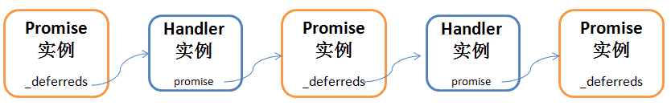

### Promise源码剖析

> NOTICE：本文所讲源码基于babel-polyfill中的Promise，应该说是最贴近浏览器/Node原生Promise的执行流程了。文末贴了核心代码

**Promise**对象用于表示一个异步操作的最终完成 (或失败)及其结果值，可以将异步操作以同步操作的流程表达出来，避免了层层嵌套的回调函数。此外，Promise 对象提供统一的接口，使得控制异步操作更加容易

一个 `Promise` 必然处于以下几种状态之一：

- *待定（pending）*: 初始状态，既没有被兑现，也没有被拒绝
- *已兑现（fulfilled）*: 意味着操作成功完成
- *已拒绝（rejected）*: 意味着操作失败

> Promise内部还有一个状态`adopted`，用来表示返回值`_value`也是一个Promise的情况

简单介绍就到这了

下面从源码角度深度剖析Promise的调用流程

#### 内部数据结构

```js
function Promise(fn) {
  ...
  this._deferredState = 0;
  this._state = 0;
  this._value = null;
  this._deferreds = null;
  ...
}
```

* `_deferredState` 它的*下一个需要处理的Promise*（下文简称p）的状态，而Handler的实例对象h包含了p的引用。有3种状态

  * 0 初始状态
  * 1 等待状态，此时`_deferreds`指向h
  * 2 等待状态，此时`_deferreds`是一个队列，h是队列中的一员

* `_deferreds` 根据`_deferredState `变化而变化，对p进行2次及以上`.then`调用时，会转化为数组（队列），p1，p2就存储在队列中。这种用法比较少

  ```js
  const p = new Promise(fn)
  const p1 = p.then(callback)
  const p2 = p.then(callback)
  ...
  ```

* `_state` 即上文介绍的Promise的4种状态

* `_value` Promise处理完成后的结果

```js
function Handler(onFulfilled, onRejected, promise) {
  this.onFulfilled = typeof onFulfilled === 'function' ? onFulfilled : null;
  this.onRejected = typeof onRejected === 'function' ? onRejected : null;
  this.promise = promise;
}
```

内部函数Handler，简单来说就是用来缓存`.then`调用产生的一系列属性，包括回调函数`onFulfilled`，`onRejected`以及新建的Promise对象，也就是上文提到的p

> **总结** Promise是一个链表+队列的数据结构。`_deferreds`是Handler对象时，则形成一个Promise链；是数组时，链式结构到此为止，但数组中的Handler的引用p又可形成新的链表+队列。在实际使用中，形成队列的情况比较少，大多数都是一个链表结构

上面知识理论分析，下面通过一段代码，debug看看真实的数据结构

```js
const Promise =  require('./promise')

const p = new Promise((resolve) => {
  setTimeout(() => resolve('executor'), 0)
})
const p1 = p.then((res) => {
  console.log("p1", res)
})
const p2 = p.then((res) => {
  console.log("p2", res)
})
p.then((res) => {
  console.log('p3', res)
  return 'p4'
}).then(res => {
  console.log(res)
})
```


最后，通过一段代码，一张图，来表示它的链式结构

```js
new Promise((resolve) => { 
 // async operations...
}).then(res => {
  // some operations
}).then(end => {
  // end
})
```



如果忽略Handler这一层包装，就可以把它看成一个真正的Promise链了

#### 调用流程

为了简化模型，不考虑队列的情况，将调用流程自定义为2个阶段

##### 宏任务阶段

即从new promise到.then链式调用完成，此阶段生成了完整的promise链

* new promise干了什么

  1. 验证：必须通过new操作符实例化Promise；必须传入回调函数fn

  2. 参数初始化

  3. 调用回调函数fn，且会给fn传入两个参数（也是函数）`resolve`和`reject`，fn执行完成后，必须调用其中一个函数，否则后续`.then`的回调函数都不会执行（`.then`函数是会执行的）

     > 为了简化步骤说明，假设fn中执行的是异步操作

* `.then`链式调用

  每次`.then`调用都会初始化一个新的Handler实例h和Promise实例p，当前Promise实例的`_deferreds`属性指向h，h的promise属性指向p，并且h中保存了`.then`传入的回调函数的引用


> NOTICE：此阶段只是在内存中生成了Promise链表，并未注册微任务

##### 微任务阶段

在此阶段，以Promise回调函数fn执行完成作为开始，执行核心流程如下


#### 总结

*  Promise是一个链表+队列的数据结构，在通常使用场景中，是一个链表
* 在宏任务阶段，只是在内存中生成了Promise链表/队列，并未注册微任务
* `.then` ，`.catch`的回调函数不一定会执行，但一定会注册微任务，且该微任务一定会执行
* 若返回值是一个Promise，则优先处理

#### Promise核心源码

```js
function noop() {
}

// States:
//
// 0 - pending
// 1 - fulfilled with _value
// 2 - rejected with _value
// 3 - adopted the state of another promise, _value
//
// once the state is no longer pending (0) it is immutable

// All `_` prefixed properties will be reduced to `_{random number}`
// at build time to obfuscate them and discourage their use.
// We don't use symbols or Object.defineProperty to fully hide them
// because the performance isn't good enough.

// to avoid using try/catch inside critical functions, we
// extract them to here.
var LAST_ERROR = null;
var IS_ERROR = {};

function getThen(obj) {
  try {
    return obj.then;
  } catch (ex) {
    LAST_ERROR = ex;
    return IS_ERROR;
  }
}

function tryCallOne(fn, a) {
  try {
    return fn(a);
  } catch (ex) {
    LAST_ERROR = ex;
    return IS_ERROR;
  }
}

function tryCallTwo(fn, a, b) {
  try {
    fn(a, b);
  } catch (ex) {
    LAST_ERROR = ex;
    return IS_ERROR;
  }
}

module.exports = Promise;

function Promise(fn, name = null) {
  if (typeof this !== 'object') {
    throw new TypeError('Promises must be constructed via new');
  }
  if (typeof fn !== 'function') {
    throw new TypeError('Promise constructor\'s argument is not a function');
  }
  this._deferredState = 0;
  this._state = 0;
  this._value = null;
  this._deferreds = null;
  this._name = name;
  if (fn === noop) return;
  doResolve(fn, this);
}

Promise.prototype.then = function (onFulfilled, onRejected, name = 'then') {
  if (this.constructor !== Promise) {
    return safeThen(this, onFulfilled, onRejected);
  }
  var res = new Promise(noop, name);
  handle(this, new Handler(onFulfilled, onRejected, res));
  return res;
};

Promise.prototype['catch'] = function (onRejected, name = 'catch') {
  return this.then(null, onRejected, name);
};

function safeThen(self, onFulfilled, onRejected) {
  return new self.constructor(function (resolve, reject) {
    var res = new Promise(noop);
    res.then(resolve, reject);
    handle(self, new Handler(onFulfilled, onRejected, res));
  });
}

function handle(self, deferred) {
  while (self._state === 3) {
    self = self._value;
  }
  if (Promise._onHandle) {
    Promise._onHandle(self);
  }
  if (self._state === 0) {
    if (self._deferredState === 0) {
      self._deferredState = 1;
      self._deferreds = deferred;
      return;
    }
    if (self._deferredState === 1) {
      self._deferredState = 2;
      self._deferreds = [self._deferreds, deferred];
      return;
    }
    self._deferreds.push(deferred);
    return;
  }
  handleResolved(self, deferred);
}

function handleResolved(self, deferred) {
  // 这里注册微任务，用domain或setImmediate模拟
  aosp(function () {
    var cb = self._state === 1 ? deferred.onFulfilled : deferred.onRejected;
    // 如果没有对应状态的回调函数，则交给下一个Promise处理
    if (cb === null) {
      if (self._state === 1) {
        resolve(deferred.promise, self._value);
      } else {
        reject(deferred.promise, self._value);
      }
      return;
    }
    var ret = tryCallOne(cb, self._value);
    if (ret === IS_ERROR) {
      reject(deferred.promise, LAST_ERROR);
    } else {
      resolve(deferred.promise, ret);
    }
  });
}

function resolve(self, newValue) {
  // Promise Resolution Procedure: https://github.com/promises-aplus/promises-spec#the-promise-resolution-procedure
  if (newValue === self) {
    return reject(self, new TypeError('A promise cannot be resolved with itself.'));
  }

  if (newValue && (typeof newValue === 'object' || typeof newValue === 'function')) {
    var then = getThen(newValue);
    if (then === IS_ERROR) {
      return reject(self, LAST_ERROR);
    }
    if (then === self.then && newValue instanceof Promise) {
      self._state = 3;
      self._value = newValue;
      finale(self);
      return;
    } else if (typeof then === 'function') {
      doResolve(then.bind(newValue), self);
      return;
    }
  }
  self._state = 1;
  self._value = newValue;
  finale(self);
}

function reject(self, newValue) {
  self._state = 2;
  self._value = newValue;
  if (Promise._onReject) {
    Promise._onReject(self, newValue);
  }
  finale(self);
}

function finale(self) {
  if (self._deferredState === 1) {
    handle(self, self._deferreds);
    self._deferreds = null;
  }
  if (self._deferredState === 2) {
    for (var i = 0; i < self._deferreds.length; i++) {
      handle(self, self._deferreds[i]);
    }
    self._deferreds = null;
  }
}

function Handler(onFulfilled, onRejected, promise) {
  this.onFulfilled = typeof onFulfilled === 'function' ? onFulfilled : null;
  this.onRejected = typeof onRejected === 'function' ? onRejected : null;
  this.promise = promise;
}

/**
 * Take a potentially misbehaving resolver function and make sure
 * onFulfilled and onRejected are only called once.
 *
 * Makes no guarantees about asynchrony.
 */
function doResolve(fn, promise) {
  var done = false;
  var res = tryCallTwo(fn, function (value) {
    if (done) return;
    done = true;
    resolve(promise, value);
  }, function (reason) {
    if (done) return;
    done = true;
    reject(promise, reason);
  });
  if (!done && res === IS_ERROR) {
    done = true;
    reject(promise, LAST_ERROR);
  }
}
```

