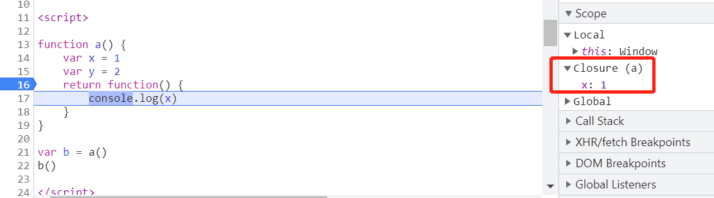
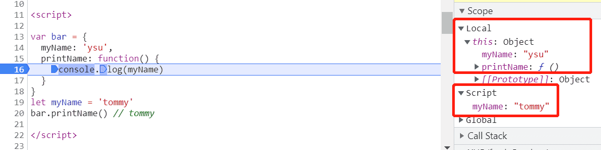

#### 执行上下文

>  执行上下文是`JavaScript`执行一段代码时的运行环境

JavaScript代码需**先编译，再执行**。

在编译阶段，会对`var`声明的变量进行变量提升，代码经过JavaScript引擎（V8）编译后，会生成2部分内容：**执行上下文**和**可执行代码**。其中执行上下文包括**变量环境、词法环境 、this**，var声明的变量存放在变量环境中，let、const声明的变量存放在词法环境中。

在**词法环境**内部，维护了一个小型栈结构，栈底是函数最外层的变量，进入一个作用域块后，就会把该作用域块内部的变量压入到栈顶；当作用域执行完成后，该作用域的信息就会从栈顶弹出

##### 执行下文类型

* 全局执行上下文，独此一份
* 函数执行上下文，函数执行时创建，执行完成后销毁（闭包除外）
* `eval`执行上下文

##### 执行上下文栈

一个JavaScript程序运行过程中会不断产生/销毁**函数执行上下文**，JavaScript引擎使用**栈**来管理执行上下文。在执行上下文创建好后，JavaScript引擎会将执行上下文压入栈中，通常把这种用来管理执行上下文的栈称为执行上下文栈，也称调用栈

##### 作用域

> 作用域是指在程序中定义变量的区域，该位置决定了变量的生命周期。通俗地理解，作用域就是变量与函数的可访问范围，即作用域控制着变量和函数的可见性和生命周期

在ES6之前，JavaScript只支持**全局作用域**和**函数作用域**，正是这种局限性，在ES6引入了像其他高级语言都支持的**块级作用域**，通过变量环境和词法环境来同时支持**变量提升**和**块级作用域**

##### 作用域链

在每个执行上下文的变量环境中，都包含了一个外部引用**outer**，用来指向外部的执行上下文。查找一个变量时，JavaScript引擎首先会在当前执行上下文中查找，如果没有找到，则继续在**outer**所指向的执行上下文中查找，如果到了全局上下文都没有找到，则抛出错误。这种查找的过程形成一个链，就叫作用域链

**JavaScript的作用域链是由词法作用域决定的，而词法作用域是由代码结构来确定的**

##### 词法作用域

词法作用域是代码阶段就决定好的，是静态的作用域，和函数是怎么调用的没有关系

##### 闭包

MDN是这样定义闭包的

> A **closure** is the combination of a function bundled together (enclosed) with references to its surrounding state (the **lexical environment**).
>  In other words, a closure gives you access to an outer function’s scope
>  from an inner function. In JavaScript, closures are created every time a
>  function is created, at function creation time.

从理论上讲，在JavaScript中，闭包伴随着函数的创建而创建。*闭包*是由函数以及声明该函数的词法环境组合而成的，该环境包含了这个闭包创建时作用域内的任何局部变量

在工程实践上，**调用一个外部函数返回一个内部函数**时，才有可能形成闭包。**在JavaScript中，根据词法作用域的规则，内部函数总是可以访问外部函数中声明的变量，当通过调用一个外部函数返回一个内部函数后，即使该外部函数已经执行结束了，但是内部函数引用外部函数的变量依然保存在内存中，这些变量的集合就成为闭包**。



##### this

先看一段代码

```js
var bar = {
  myName: 'ysu',
  printName: function() {
    console.log(myName)
  }
}
let myName = 'tommy'
bar.printName() // tommy
```

预期是要输出ysu，但实际输出的是tommy，由作用域的定义也能解释这个结果。也就是说**JavaScript的作用域机制不支持在对象内部的方法中使用对象内部的属性**。基于这个缺陷，JavaScript搞出了另一套**this机制**



this是和执行上下文绑定的，每个执行上下文中都有一个this。全局执行上下文中的this指向window/self，函数执行上下文的this是在运行期确定的，也就是说它是可动态改变的

1. 可通过函数的call/bind/apply来改变this指向
2. 通过对象调用的方式来改变。因为一个函数中this的指向，是由**直接**调用它的对象来决定的
3. 通过构造函数改变

**this的设计缺陷及应对方案**

* 嵌套函数中的this不会从外层函数中继承

  1. 在外层函数中声明一个变量保存this。本质是把this体系转换为了作用域体系

  2. 使用ES6中的箭头函数

     > > **箭头函数表达式**的语法比[函数表达式](https://developer.mozilla.org/zh-CN/docs/Web/JavaScript/Reference/Operators/function)更简洁，并且没有自己的`this`，`arguments`，`super`或`new.target`。箭头函数表达式更适用于那些本来需要匿名函数的地方，并且它不能用作构造函数
     >
     > - 外形不同
     > - 箭头函数都是匿名函数
     > - 箭头函数不能用于构造函数，不能使用`new`
     > - `this`指向不同。在普通函数中，this总是指向调用它的对象，如果用作构造函数，this指向创建的对象实例
     > - 箭头函数不具有prototype原型对象

* 普通函数中的this默认指向全局对象window

  * 设置JavaScript的严格模式解决

##### Chrome眼中的闭包

看了上面的概念，理解了多少？看几个例子

```js
// 题1
var a = 1
function foo() {
  function bar() {
    console.log(a)
  }
  return bar
}
var f = foo()
f()

// 题2
var a = 1
var obj = {
  a: 2,
  foo: function () {
    return function () {
      console.log(this.a)
    }
  }
}
obj.foo()()

// 题3
var a = 1
var obj = {
  a: 2,
  foo: function () {
    return () => {
      console.log(this.a)
    }
  }
}
obj.foo()()

// 题4
var a = 1
var obj = {
  a: 2,
  foo: function () {
    var _this = this
    return function () {
      console.log(_this.a)
    }
  }
}
obj.foo()()

// 题5
var a = 1
var obj = {
  a: 2,
  foo: function () {
    return () => {
      console.log(arguments)
    }
  }
}
obj.foo()()
```

* 问题1：题1~4分别输出什么？
* 问题2：题1~5哪些会形成闭包？为什么？

对于问题1，相信所有人都答出来，答案是1,1,2,2

对于问题2，可能有些人和我开始一样，有些迷糊的

先公布一下答案：不会，不会，不会，会，会。你也可以在chrome上debugger一下以上代码，查看它的Scope

下面一一解答为什么

* 题1

  还记得上面对闭包的定义吗？`内部函数引用外部函数的变量，这些变量的集合成为闭包`，虽然foo函数嵌套了bar函数，但bar并未引用foo中的变量，所以不会形成闭包

* 题2

  * JavaScript的this无法继承，匿名函数中的this和foo无关
  * `obj.foo()()`等价于`var bar = obj.foo(); window.bar()`，this指向直接调用它的对象window，所以结果是1
  * 其实基于上面2点也可以判断出不会形成闭包了，但真正的原因并不是这个

* 题3

  * 箭头函数继承foo的this，所以输出2
  * 那为什么不会形成闭包呢，不是引用了foo的this属性吗？`闭包是基于作用域/链机制而产生的，this是另一套完全不同的机制`，在上面也提到过，JavaScript的作用域机制是无法访问对象的属性的，所以才引出了this机制，在这里，使用的是this机制访问obj的属性a，而非作用域机制

* 题4

  * _this指向obj，输出2
  * 题3不是说this机制不会形成闭包吗？这里怎么又会形成闭包呢！因为foo中定义了属性_this，而在内部函数中也引用了该属性，本质是把this体系转换为了作用域体系

* 题5

  * 箭头函数没有自己的this、arguments，它使用了foo的属性arguments，所以会形成闭包