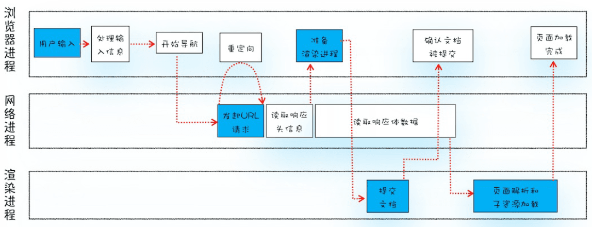
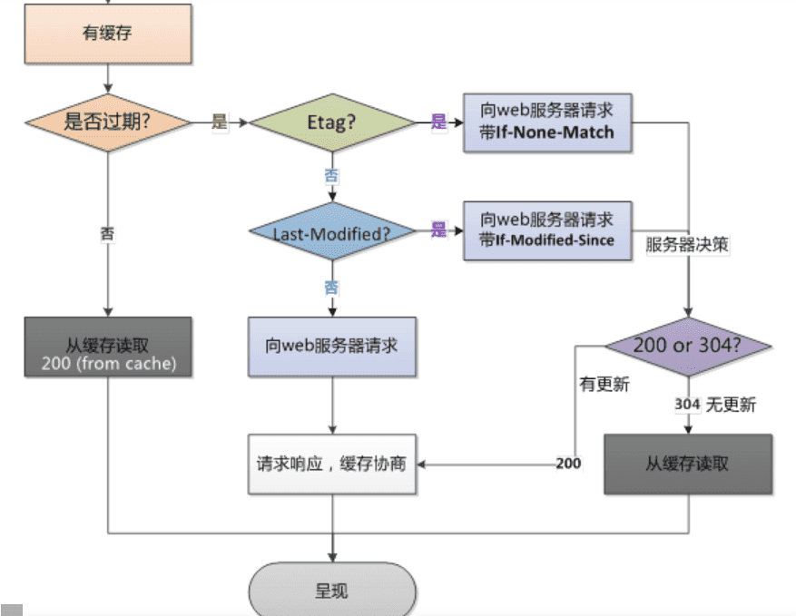
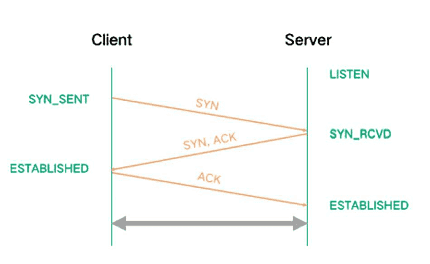

### 浏览器从输入URL到渲染完成的过程

现代浏览器是多进程架构，主要进程有

* `浏览器主进程` 主要负责界面显示、用户交互、子进程管理，提供存储功能
* `GPU进程` GPU 的使用初衷是为了实现 3D CSS 效果，随后浏览器都选择 GPU 来加速网页绘制
* `网络进程` 主要负责网络资源的加载
* `渲染进程` 主要是将 HTML、CSS 和 JS 转换为用户可以与之交互的网页，排版引擎 Blink 和 JavaScript 引擎 V8 都是运行在该进程中，一般一个 tab 页对应一个渲染进程
* `插件进程` 负责插件运行，隔离在沙盒内

主要步骤有

#### 一、主进程处理用户输入

1. 浏览器首先会判断输入的信息是否是一个合法的`URL`或`域名`或`IP`
   * 是URL，进入步骤2
   * 是域名或 IP，则自动补全协议
     * 判断域名是否在`hsts`缓存（即带有`Strict-Transport-Security`响应头）或预置列表中，如果在，使用`https`协议
   * 以上都不是，则调用浏览器默认搜索
2. 提交请求给网络进程加载资源

#### 二、网络进程获取资源

##### 1、查找是否存在未过期的缓存

* `Memory Cache` 忽视请求头响应信息，如`no-cache,max-age=0`
* `Http Cache` 

  * **强缓存**

    通过`Pragma`、`Expires`、`Cache-Control`响应头来判断是否可以使用强缓存

    > 1. Pragma和Expires是1.0缓存方案，Cache-Control优先级更高
    > 2. Expires是服务端时间，可能和客户端时间存在较大误差，不可靠
    > 3. Cache-Control: max-age=60，是有效时间（s），客户端可根据这个时间计算准确的过期时间，可靠
    > 4. 强缓存包括`disk cache`，`service worker`...
    > 5. 启发式缓存：
    >    - 如果响应中没有Expires、Cache-Control等相关缓存限制，缓存可以使用启发式方法计算新鲜度寿命。通常根据响应头中字段Date减去Last-Modified值的10%作为缓存时间

  * **协商缓存**

    

    > 1. `Etag`是服务器自动生成或者由开发者生成的对应资源在服务器端的唯一标识符，能够更加准确的控制缓存
    > 2. `Last-Modified`标注的最后修改只能精确到秒级，如果某些文件在1秒钟以内，被修改多次的话，它将不能准确标注文件的新鲜度
    > 3. 如果某些文件会被定期生成，当有时内容并没有任何变化，但`Last-Modified`却改变了，导致文件没法使用缓存
    > 4. 有可能存在服务器没有准确获取文件修改时间，或者与代理服务器时间不一致等情形
    > 5. 分布式系统下，建议关闭`Etag`

##### 2、DNS 解析出 IP

查找链路包括

- 浏览器缓存
- 系统本地。如windows的hosts文件
- 本地域名服务器（自动获取或手动设置DNS服务器）
  - 根域名服务器
  - 顶级域名服务器
  - 二级域名服务器
  - 三级域名服务器
  - ......

##### 3、建立 https 连接

- 3次 TCP 握手

- > 1. 三次握手是为了建立**稳定的双向**连接
  > 2. 建连时，可能发生`SYN`洪水攻击。即Client端建立连接后，不回复`ACK`，导致Server端大量链接处于`SYN_RCVD`状态，进而影响其他正常请求的建连。可设置 `tcp_synack_retries=0`加快半连接的回收速度，或者调大`tcp_max_syn_backlog`来应对少量的SYN洪水攻击
  > 3. `TCP`的特点
  >    - 基于连接，双向通信，可靠传输
  >    - 传输基于字节流而不是报文。将数据按字节大小进行编号，接收端通过ACK来确认收到的数据编号，通过这种机制，TCP协议能够保证接收数据的有序性和完整性
  >    - 提供流量控制能力，通过滑动窗口来控制数据的发送速率（默认启用**窗口缩放**）。滑动窗口的本质是动态缓冲区，接收端根据自己的处理能力，在TCP的Header中动态调整**接收窗口（rwnd）**的大小，通过ACK应答包通知给发送端，发送端根据窗口大小调整发送的速度
  >    - 提供拥塞控制和预防机制，以应对网络问题。处理拥塞机制主要用到了慢启动、拥塞预防、快速重传、快速恢复4个算法
  >      - 一般禁用SSR（慢启动重启），增大 TCP 初始拥塞窗口（cwnd）
  >      - 超过rwnd或出现丢包，则拥塞预防算法介入，一般用**比例降速**算法

- 4次 TLS 握手

  1. 客户端向服务端发送Client Hello消息，消息以明文形式传输，里面包括客户端支持的协议版本、加密套件、压缩算法、随机数R1、扩展字段等。加密套件包括认证算法（Au）、密钥交换算法（KeyExchange）、对称加密算法（Enc）和信息摘要算法
  2. 服务端发送Server Hello消息进行响应，以明文传输。消息包括确认使用的协议版本、服务端生成的随机数R2、确认使用的加密套件和压缩方法
     - 发送完Server Hello消息后，服务端马上将自己的Certificate（公钥证书）发送给客户端
     - Server Key Exchange并非必需选项，只有在选用了DH算法的情况下，服务器需要将DH参数发送给客户端，若选择了RSA算法则不需要发送Server Key Exchange
     - Certificate Request也并非必须选项，在对于安全性要求较高的场景中，服务器可要对客户端的身份进行认证，因此发起了对客户端公钥证书的请求，一般情况下浏览器都会内置一对独一无二的公私钥
     - 由于第二次握手中包含一些可选选项，因此需要服务器发送一个Server Hello Done的消息，用来通知客户端Server Hello过程结束
     - 在客户端收到Server Hello Done之后并没有马上进行第三次握手，而是先对服务器传来的证书进行验证，一般会验证证书是否在有效期内，随后根据CRL或者OCSP查询证书是否有效，最后根据证书链从根CA开始验证直到网站证书，以确保证书的真实性。在这个过程中若出现了验证不通过的结果，则抛出相应的错误；若验证通过，就再生成一个随机数Pre-master，并用服务器公钥进行加密，生成PreMaster Key
  3. Client Key Exchange就是客户端将PreMaster Key发送给服务器，服务器则会用自己的私钥解密得出Pre-master。到这里客户端和服务器都拥有了三个随机数R1、R2和Pre-master，两边再用相同的算法和这三个随机数生成一个密钥，用于握手结束后传输数据的对称加密
     - Change Cipher Spec是客户端向服务器通知，后面发送的消息都会使用协商出来的密钥进行加密
     - Encrypted Handshake Message是客户端向服务发送握手数据加密信息，该信息是客户端将前面的握手消息利用协商好的摘要算法生成摘要，再用协商好的密钥对摘要进行加密而的出来的，最后将加密信息发送给服务器，这是客户端发出的第一条加密信息。而服务器也会用协商好的密钥进行解密，若能成功解密则说明协商出来的密钥是一致的
     - Certificate是在第二次握手的第4步有进行的情况下，即服务器有向客户端请求证书的情况才会有的，这一步是客户端向服务器发送客户端的证书，而服务器收到证书后也会对证书进行相同的验证
  4. Change Cipher Spec是服务器向客户端通知，后面发送的消息都会使用协商出来的密钥进行加密
     - Encrypted Handshake Message与第三次握手类似，是服务器发给客户端的用来确定协商的密钥是一致的，也是一条Server Finish消息

#####4、发送加密请求

- SSL加密
- TCP组包
- 网络层负责地址管理以及路由选择，使用IP协议，为数据加上**IP头**
- 数据链路层负责相邻设备之间的数据帧的传输。主要使用以太网帧协议。负责在一段数据的前后分别添加**首部**和**尾部**构成了一个帧

#####5、服务端收到请求并响应

- 将加密后的数据发送给浏览器

#####6、浏览器网络进程收到完整响应数据

> 可能存在重定向

- 各层级解包、丢包重传等
- 响应数据类型（Content-Type）处理
- 根据 HTTP/S 响应头缓存收到的数据
- 提交文档给渲染进程

#### 三、渲染阶段

###### 8. 浏览器解析HTML

- 解析HTML生成DOM树

- > 1. 如遇到外部资源，又会涉及到缓存、下载，下载会重用已有的TCP连接。同一域名下最多开启6个TCP连接
  > 2. 如遇CSS，异步下载，不影响解析流程
  > 3. 如遇同步JS，则等待JS下载并执行完成；如是异步JS，解析流程继续执行

- 解析CSS生成CSSOM树

- 将DOM树和CSSOM树合并成Render Object树

- 渲染树布局

- 渲染树绘制
